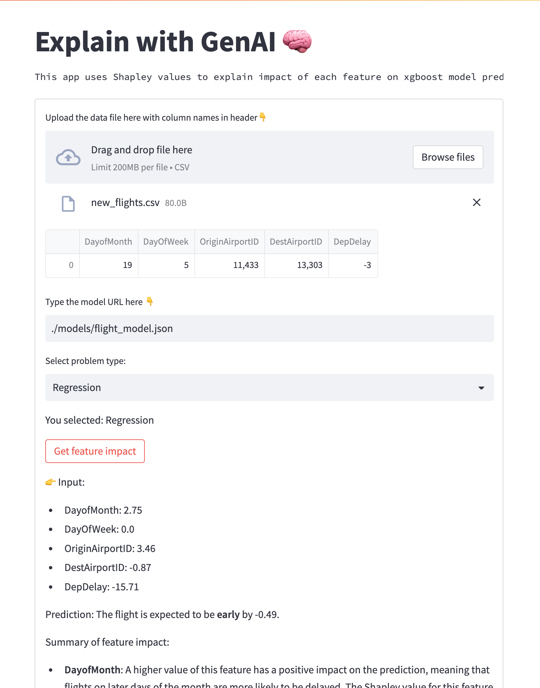

# Streamlit application for interpreting the model output using LLM and Shapley values for xgboost models

The xgboost model and test data needs to be provided to get the explanation of predictions. It works both for classification and regression. 

* Note:Currently works to explain single data point. Work in progress to accept more than one data points in the csv file. The app needs Python 3.9 to run.

## To Run
1. In the working dir, create a .env file to store the OPENAI_API_KEY.
1. Create a virtual environment `path/to/python3.9 -m venv .venv` 
1. Activate the virtual environment `source .venv/bin/activate`
1. Update pip before anything else, `pip install --upgrade pip`
1. Install required packages `pip install -r requirements.txt`
1. `streamlit run app.py` is a streamlit app.
1. Upload the data as csv and pass the path of model or the URL. Cannot upload XGboost model as the load_model API only accepts json or byte converted files.
1. Select the problem type: Classification or Regression.
1. You can test with models and data under ./models and ./test_data_for_app or use your own model or data. If you use your own data you should make changes to prompt under `understand_explanations_with_llm.py`.

## To do
* Accept more than one data point in the file.

